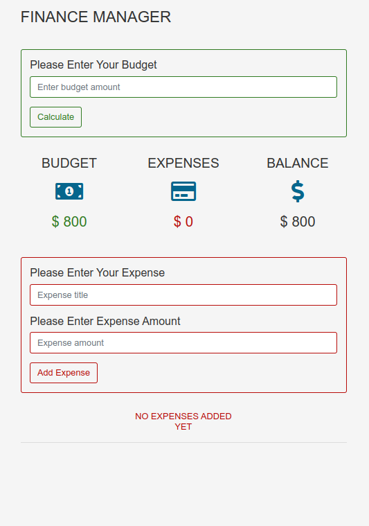

# Budget Tracker App

A simple and interactive budget tracking application that allows users to manage their budget and track their expenses efficiently. This app provides features for setting a budget, adding expenses, and viewing the balance.

## Table of Contents

- [Features](#features)
- [Technologies Used](#technologies-used)
- [Getting Started](#getting-started)
- [Usage](#usage)
- [Contributing](#contributing)
- [License](#license)

## Features

- Set and manage your budget
- Add, edit, and delete expenses
- View your current balance
- Persistent storage using `localStorage`
- User-friendly interface with feedback messages

## Technologies Used

- HTML
- CSS
- JavaScript OOP
- Webpack

## Getting Started

To get started with this project, follow the steps below:

1. **Clone the repository**:
   ```bash
   [git clone https://github.com/TomyJusuf/Finance-Manager.git]
   ```

## Usage

1. **Set Your Budget**: Enter your budget in the budget input field and click **Submit** to set your budget.
2. **Add Expenses**: Add your expenses by entering the title and amount, then click **Submit** to add them to your expense list.
3. **Edit/Delete Expenses**: You can edit or delete expenses using the edit and delete icons next to each expense item.
4. **View Current Balance**: Your current balance will update automatically based on your budget and expenses.

## Contributing

- **Project Title**: Finance Manager - Object Oriented Programing.
- **Description**: Budget Tracker App helps users effectively manage their monthly budget and expenses with a clear user interface. Users can easily enter their income and expenses, track their current balance and make adjustments right in the expense list.

- **Technologies Used**: HTML, CSS, BOOTSTRAP, JAVASCRIPT ( OBJECT ORIENTAD PROGRAMING) - WEBPACK

- **Screenshots**:

  ```markdown
  ## Screenshots
  ```



```
- TomasMatusek@seznam.cz

```
# Finance-Manager
